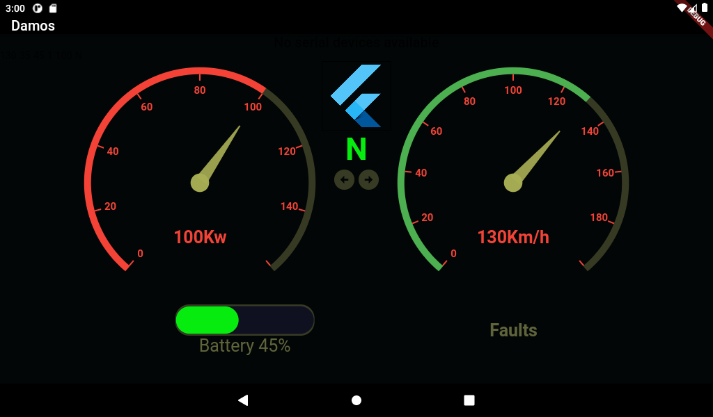

# flutter_application_629

EV instrument cluster android UI, shows real-time CAN-Bus data on android tablet connceted to Arduino UNO and CAN-BUS shield. 

## Getting Started

- The flutter application is showing speed, power, battery level, gear selected, and right-left signals.
- There are so many other information that CAN-BUS can provide like rpm, throttle position, heat readings, fault codes, and other sensors readings,  etc...
- Arduino will be able to accept inputs other than CAN-BUS, I used the digital inputs to check which gear is selected and also to check the light signals.
- The C code for arduino is including calculations and some settings that relate to CAN-BUS communication.
- I used syncfusion_flutter_gauges library for flutter, it is easy to use.
Other useful plugins like Google maps can be added to the interface.

## Hardware:
- CAN-BUS is a communication system that can connect all the electronic control units inside the vehicle together.
- My work on the GUI started after integrating complete Hyper9 EV conversion kit inside a vehicle.
- CAN-BUS sheild from SparkFun is a controller that can fit on Arduino UNO board, it has DB9 connector including CAN-H and CAN-L ports to connect to OBD-II.
- I'm using usb-serial to connect the arduino board to the Android tablet (USB to type-B converter).

## Other:  
- Currently the application is running well inside the car without any issues.
- I need suggestions.
- I'm ready to help if anyone is interested, we can discuss about the C and Dart scripts, also about the communication system and hardware specifications.
- This project could be helpful for who is working on electric vehicle conversion kits, and planning to design his own instrument cluster and infotainment system.