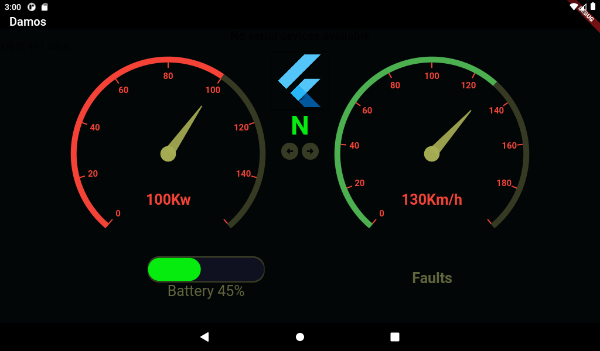

# EV Instrument Cluster Flutter Application
# flutter_application_629

A real-time EV instrument cluster and telemetry Android platform built with Flutter, integrating CAN-bus communication with Hyper9 motor controllers, the Orion Battery Management System (BMS), and vehicle subsystems such as the Body Control Unit (BCU). Designed for electric vehicle conversion kits, custom digital dashboards, telemetry monitoring, and next-generation EV infotainment systems.

## Getting Started

- The flutter application is showing speed, power, battery level, gear selected, and right-left signals.
- There are so many other information that CAN bus can provide like rpm, throttle position, heat sensor readings, fault codes, and other sensors readings,  etc...
- Arduino will be able to accept inputs other than CAN bus, I used the digital inputs to check which gear is selected and also to check the light signals.
- The C code for arduino is including calculations and some settings that relate to CAN bus communication.
- I used syncfusion_flutter_gauges library for flutter, it is easy to use.
Other useful plugins like Google maps can be added to the interface.

## Key Features:
- Real-time CAN bus telemetry visualization
- Hyper9 motor controller integration
- Orion BMS integration
- Responsive Flutter-based Android dashboard
- Speed, power, battery, and gear monitoring
- Turn signal and digital input integration
- Expandable architecture for GPS, diagnostics, and infotainment
- Arduino-based CAN decoding layer
- Designed for EV conversion projects and custom vehicle platforms

## Hardware:
- CAN bus is a communication system that can connect all the electronic control units inside the vehicle together.
- My work on the GUI started after integrating the Hyper9 motor EV conversion kit inside a vehicle.
- CAN bus sheild from SparkFun is a board that can be easily integrated with Arduino UNO board, it has DB9 connector including CAN-H and CAN-L ports to connect to OBD-II.
- I'm using usb-serial to connect the arduino board to the Android tablet (USB to type-B converter).

## Other:  
- Currently the application is successfully deployed and tested in a real EV-converted vehicle under live driving conditions.
- I need suggestions.
- I'm ready to help if anyone is interested, we can discuss about the C and Dart scripts, also about the communication system and hardware specifications.
- This project could be helpful for who is working on electric vehicle conversion kits, and planning to design his own instrument cluster and infotainment system.
